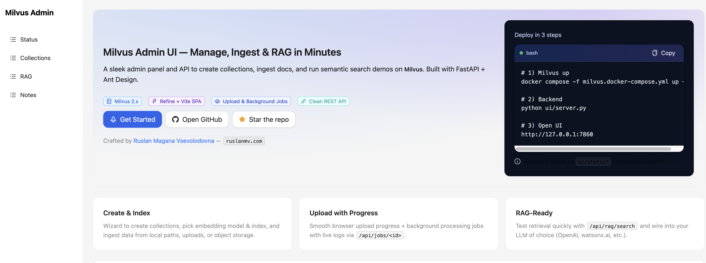

<h1 align="center">Milvus Admin UI</h1>

<p align="center">
  <b>Manage, Ingest & RAG with Milvus in minutes</b><br/>
  FastAPI + Ant Design admin with browser uploads, background jobs, and a clean REST API.
</p>

<p align="center">
  <a href="https://github.com/ruslanmv/milvus-admin-ui/stargazers">
    
  </a>
  <a href="https://github.com/ruslanmv/milvus-admin-ui/blob/main/LICENSE">
    
  </a>
  
  
  
  
</p>

<p align="center">
  Crafted by <a href="https://ruslanmv.com" target="_blank">Ruslan Magana Vsevolodovna</a> · ⭐ <a href="https://github.com/ruslanmv/milvus-admin-ui" target="_blank">Star the repo</a>
</p>




---

## ✨ What you get

- 🧭 **Status & health**: server version, healthz, and collection details.
- 🧰 **Collections**: create/drop, index selection (IVF/HNSW/AUTOINDEX), metric (IP/L2/COSINE).
- 🚀 **RAG demo**: quick insert & semantic search using sentence-transformers.
- ☁️ **Ingestion sources**:
  - **Browser upload** with real **upload progress** (bytes) + **processing progress** (background job).
  - Local folder on server (`/api/sync`).
  - HTTP URLs / S3 / IBM COS via generated config for your pipeline.
- 🧵 **Background jobs**: `/api/jobs/{id}` with live log tails (ingest + index build).
- 🔐 **Security controls**: `X-Admin-Token`, `ALLOW_REMOTE_UPLOAD`, `ALLOW_REMOTE_SYNC`.
- 🧪 **Model-aware UX**: backend lists supported embedding models + dims; UI auto-syncs collection dim.

---

## ⚡ Quick start

> Prereqs: Docker, Docker Compose, Python 3.11, Node.js (for UI build, optional)

```bash
# 1) Create & activate venv
python3.11 -m venv .venv
source .venv/bin/activate         # Windows: .venv\Scripts\activate

# 2) Install backend (editable) + required multipart
pip install -U pip
pip install -e .


# 3) Bring up Milvus stack (etcd + minio + milvus)
docker compose -f milvus.docker-compose.yml up -d

# 4) Run the backend (serves UI from ui/static)
python ui/server.py
# * Milvus Admin UI: http://127.0.0.1:7860
````

Open **[http://127.0.0.1:7860](http://127.0.0.1:7860)**

> If you change the frontend, build it (outputs to `ui/static`):
>
> ```bash
> # In repo root
> pnpm i && pnpm build   # or: npm i && npm run build  (or yarn)
> ```

---

## ⚙️ Configuration

Create a `.env` in repo root (defaults shown):

```ini
# --- Milvus ---
MILVUS_HOST=127.0.0.1
MILVUS_PORT=19530
MILVUS_HEALTH_PORT=9091
# MILVUS_URI=                  # alternative to host/port
# MILVUS_USER=
# MILVUS_PASSWORD=
# MILVUS_DB=

# --- UI ---
UI_PORT=7860

# --- Ingest defaults ---
RAG_MODEL=sentence-transformers/all-MiniLM-L6-v2
DATA_SOURCE_ROOT=./data
UPLOAD_WORKDIR=./uploads

# --- Search tuning (optional) ---
MILVUS_NPROBE=10
MILVUS_EF=64

# --- Security ---
ALLOW_REMOTE_UPLOAD=true        # allow browser uploads from other hosts
ALLOW_REMOTE_SYNC=false         # keep /api/sync local-only
# ADMIN_TOKEN=change-me         # require X-Admin-Token header for sensitive endpoints
```

---

## 🧩 Supported embedding models

The backend exposes a catalog at **`GET /api/rag/models`** and the UI auto-updates the *dim* when you switch models:

* `sentence-transformers/paraphrase-MiniLM-L6-v2` (384d)
* `sentence-transformers/all-MiniLM-L6-v2` (384d)
* `BAAI/bge-small-en-v1.5` (384d)
* `intfloat/e5-small-v2` (384d)

> Add more in `EMBED_MODEL_CATALOG` (server) as needed.

---

## 🖥️ Using the Wizard (Upload + Progress)

1. **Schema** – choose name, metric, index type; dim auto-syncs with selected model.
2. **Data source** – pick **Upload from browser** (or Local/HTTP/S3/IBM).
3. **Ingest options** – model, chunk size/overlap, OCR, language detection, dedupe.
4. **Review & Create** – two progress bars:

   * **Upload**: client → server bytes (Axios `onUploadProgress`).
   * **Processing**: background job (`/api/jobs/{id}`) for ingest + index build, with log tail.

**Pipeline (Mermaid)**

```mermaid
graph LR
    A[Browser files] -->|multipart| B[/api/ingest/upload/];
    B -->|save to UPLOAD_WORKDIR| C[Background Job];
    C --> D[mui-ingest --source-root <job_dir>];
    D --> E[mui-create-vectordb];
    E --> F[Milvus collection + index];
    C -->|/api/jobs/{id}| G[UI progress + logs];
```

---

## 🔌 API Reference (short)

* `GET /api/status` – health & collections
* `GET /api/collections` – list
* `POST /api/collections` – create (JSON **or** form body)
* `DELETE /api/collections/{name}` – drop
* `POST /api/rag/insert` – insert demo docs (for the simple `[doc_id, text, vec]` schema)
* `POST /api/rag/search` – semantic search
* `POST /api/ingest/upload` – multipart upload → background ingest job
* `GET /api/jobs` – list jobs
* `GET /api/jobs/{id}` – job status + logs tail
* `POST /api/sync` – server-side ingest from `DATA_SOURCE_ROOT` (local-only by default)
* `GET /api/rag/models` – embedding models (id+label+dim) for UI

### cURL: create collection

```bash
curl -X POST http://127.0.0.1:7860/api/collections \
  -H "Content-Type: application/json" \
  -d '{"name":"documents","dim":384,"metric":"IP","index_type":"IVF_FLAT","nlist":1024}'
```

### cURL: upload a file and ingest

```bash
curl -X POST http://127.0.0.1:7860/api/ingest/upload \
  -F "collection=documents" \
  -F "model=sentence-transformers/all-MiniLM-L6-v2" \
  -F "files=@/path/to/Milvus.md"
# -> {"ok":true,"job":{"id":"abcd1234",...}}

curl http://127.0.0.1:7860/api/jobs/abcd1234
```

---

## 🧪 RAG Demo: insert + search

**Python**

```python
import requests, json
BASE = "http://127.0.0.1:7860"

requests.post(f"{BASE}/api/rag/insert", json={
  "collection":"documents",
  "docs":[
    {"doc_id":"1","text":"How do I reset my LDAP password?"},
    {"doc_id":"2","text":"Postmortem template for production incidents."}
  ]
})

r = requests.post(f"{BASE}/api/rag/search", json={
  "collection":"documents", "query":"Where is the incident template?", "topk":3
})
print(json.dumps(r.json(), indent=2))
```

**PyMilvus**

```python
from pymilvus import connections, Collection
from sentence_transformers import SentenceTransformer

connections.connect(host="127.0.0.1", port="19530")
c = Collection("documents"); c.load()

model = SentenceTransformer("sentence-transformers/paraphrase-MiniLM-L6-v2")
qv = model.encode(["incident template"], normalize_embeddings=True).tolist()
res = c.search(qv, "vec", param={"nprobe":10}, limit=5, output_fields=["doc_id","text"])
```

---

## 🔐 Security

* Set **`ADMIN_TOKEN`** and send **`X-Admin-Token`** for sensitive endpoints (`/api/ingest/*`, `/api/sync`).
* Control remote access:

  * `ALLOW_REMOTE_UPLOAD=true|false` (defaults **true**)
  * `ALLOW_REMOTE_SYNC=true|false` (defaults **false**)
* Never expose your backend publicly without auth in place.

---

## 🛠️ Troubleshooting

* **422 on `POST /api/collections`**
  Ensure body has `name`, `dim`, `metric`, `index_type`, `nlist` (for IVF). The backend accepts JSON **or** form-encoded.

* **`RuntimeError: Form data requires "python-multipart"`**
  Install: `pip install python-multipart`.

* **Milvus not reachable**
  Check compose is healthy and `curl http://127.0.0.1:9091/healthz` returns 200. Verify `MILVUS_HOST/MILVUS_PORT`.

* **Embeddings dimension mismatch**
  Pick the model in the UI; dim auto-syncs. Or set `dim` to your selected model’s output.

---

## 🏗️ Production notes

* Reverse proxy with NGINX/Caddy; enable TLS; restrict origins.
* Run `ui/server.py` under a supervisor (systemd) and keep `UPLOAD_WORKDIR` on fast storage.
* For large corpora, prefer **S3/IBM COS** ingestion; browser uploads are best for small/medium sets.

---

## 🤝 Contributing

PRs welcome! Please:

* Keep endpoints simple and documented.
* Add to `EMBED_MODEL_CATALOG` when introducing models.
* Mind types and error messages for smooth UX.

---

## 📜 License

Apache-2.0 © 2025 Ruslan Magana Vsevolodovna — [https://ruslanmv.com](https://ruslanmv.com)

---

## ⭐ Support

If this project saved you time, **please give it a star**:

**[https://github.com/ruslanmv/milvus-admin-ui](https://github.com/ruslanmv/milvus-admin-ui)**

