<h1 align="center">milvus-admin-ui</h1>

<p align="center">
  <b>Manage, Ingest & Build RAG over your Vector DB in minutes</b><br/>
  Production-ready FastAPI backend + lightweight UI with browser uploads, background jobs, and a clean REST API.
</p>

<p align="center">
  <a href="https://github.com/ruslanmv/milvus-admin-ui/stargazers">
    
  </a>
  <a href="https://github.com/ruslanmv/milvus-admin-ui/blob/main/LICENSE">
    
  </a>
  
  
  
  
  
</p>

<p align="center">
  Crafted by <a href="#" target="_blank">Ruslan Magana Vsevolodovna</a> · ⭐ <a href="https://github.com/ruslanmv/milvus-admin-ui" target="_blank">Star the repo</a>
</p>


---

## ✨ What you get

- 🧭 **Status & health** — server version, Milvus health endpoints, collections, indexes, and entity counts.
- 🧰 **Collection lifecycle** — create/drop, metric (IP/L2/COSINE), index (IVF/HNSW/AUTOINDEX), load/release.
- 🚀 **RAG demo** — quick insert & search using sentence-transformers; model catalog exposes correct vector dims.
- 📥 **File Ingestion Wizard** — **browser uploads** with live progress + server-side sync. Background jobs expose stage + logs.
- 🧵 **Background jobs** — `/api/jobs/{id}` with stages (saved → ingest → index → done) and tail-able logs for observability.
- 🧪 **Model-aware UX** — backend exposes supported embedding models and dimensions; UI enforces schema alignment.
- 🔐 **Enterprise controls** — `X-Admin-Token`, `ALLOW_REMOTE_UPLOAD`, `ALLOW_REMOTE_SYNC`, predictable API surface.
- ⚙️ **Batteries included** — dockerized Milvus, simple `.env`, clean Python packaging, CI-friendly test scripts.

---

## 🧾 Docling-powered Document Extraction

This project integrates a production-ready extraction layer that uses **Docling** to convert heterogeneous documents into normalized **Markdown → text chunks** as part of the ingestion pipeline.

**Why this matters in enterprise:**

- **Broad format coverage** — PDF, Office (Word/PowerPoint/Excel), HTML/Markdown, TXT/RTF, CSV/JSON/JSONL, EPUB, and images.
- **Consistent structure** — Markdown export harmonizes headings/sections for predictable chunking.
- **Low-latency ingestion** — in-process streaming conversion reduces memory and avoids temp files.
- **Scalable chunking** — tunable `chunk_size`/`overlap`, language detection, and content de-duplication.
- **Operational safety** — stable chunk IDs, deterministic normalization, schema guardrails for vector dims.
- **Observability** — fine-grained timing for convert/export/chunking with aggregated per-job stats.

> Docling is part of the ingestion workflow. No extra action is required during normal usage.

### Supported at a glance

- **Documents:** `.pdf`, `.doc/.docx`, `.ppt/.pptx`, `.rtf`, `.epub`
- **Web/markup:** `.html/.htm`, `.md/.mdx`, `.txt`
- **Data files:** `.csv`, `.json`, `.jsonl`, `.xls/.xlsx`
- **Images (OCR path):** `.png`, `.jpg/.jpeg`, `.tif/.tiff`, `.bmp`, `.gif`, `.webp`

---

## ⚡ Quick Start

> **Goal:** up and running in **two commands**. Milvus via Docker, backend serves the UI.

```bash
# 1) Install & prepare (creates venv, installs backend)
make install
````

```bash
# 2) Run: starts Milvus stack and the milvus-admin-ui API+UI
make run
# ➜ http://127.0.0.1:7860
```

> **No Make?** Use the raw steps:
>
> ```bash
> python3.11 -m venv .venv && source .venv/bin/activate
> pip install -U pip && pip install -e .
> docker compose -f milvus.docker-compose.yml up -d
> python ui/server.py
> ```
>
> **(Optional) Build frontend:** `npm i && npm run build` → `ui/static`.

---

## 🧙 Ingestion Wizard (end-to-end flow)

1. **Select source:** Browser upload, server folder, HTTP URLs, S3/IBM COS (config generator provided).
2. **Choose options:** embedding model, chunk size/overlap, OCR, language detection, de-duplication.
3. **Run:** follow **Upload** progress and **Processing** (background job) with live logs.
4. **Serve:** vectors are inserted and indexes built; the collection is loaded for search.

**Pipeline overview**

```mermaid
graph TD
    %% Define distinct node styles for clarity
    style U fill:#d5f3d5,stroke:#3c803c,stroke-width:2px,color:#1e4d1e
    style S fill:#f9f9db,stroke:#8c8c27,stroke-width:2px,color:#5c5c1a
    style W fill:#efefef,stroke:#999,stroke-dasharray: 5 5
    style J fill:#dbe7ff,stroke:#5588cc,stroke-width:2px,color:#2c4b82
    style L fill:#dbe7ff,stroke:#5588cc,stroke-width:2px,color:#2c4b82
    style X fill:#ffe0e0,stroke:#cc5555,stroke-width:2px,color:#822c2c
    style C fill:#ffe0e0,stroke:#cc5555,stroke-width:2px,color:#822c2c
    style E fill:#ffe0e0,stroke:#cc5555,stroke-width:2px,color:#822c2c
    style V fill:#e0f7fa,stroke:#00bcd4,stroke-width:2px,color:#00796b

    %% Nodes
    U[User / Browser Upload]
    S[/api/ingest/upload/]
    W{Upload Workdir}
    J((Background Job))
    X(Docling Extraction → Markdown)
    C(Chunking / Dedup / Metadata)
    E(Embedding)
    V[(Milvus Vector DB)]
    L[api jobs id logs progress]

    %% Connections
    U -- multipart --> S
    S --> W
    W --> J

    %% Parallel Path for Job Status
    J --> L

    %% Sequential Processing within the Job
    J --> X
    X --> C
    C --> E
    E --> V
```



---

## 🔌 API Reference (cURL)

**Status**

```bash
curl -s http://127.0.0.1:7860/api/status | jq .
```

**Create a collection**

```bash
curl -X POST http://127.0.0.1:7860/api/collections \
  -H "Content-Type: application/json" \
  -d '{"name":"documents","dim":384,"metric":"IP","index_type":"IVF_FLAT","nlist":1024}'
```

**Upload + ingest**

```bash
curl -X POST http://127.0.0.1:7860/api/ingest/upload \
  -F "collection=documents" \
  -F "model=sentence-transformers/all-MiniLM-L6-v2" \
  -F "chunk_size=512" -F "overlap=64" \
  -F "normalize=true" -F "ocr=false" -F "language_detect=true" -F "dedupe=true" \
  -F "files=@/path/to/Guide.pdf"
```

**Job progress**

```bash
curl http://127.0.0.1:7860/api/jobs/<job_id>
```

---

## 🧪 Testing & Diagnostics

* **End-to-end RAG**: `scripts/test_workflow.sh` (creates a collection, inserts, searches).
* **Docling smoke test**: `scripts/test_docling.sh` + `tests/test_docling.py`

  * Generates a small corpus (MD/HTML/TXT/CSV/JSON; PDF optional) and validates the conversion pipeline.
  * Prints timing for **convert**, **export**, **native I/O**, **chunking**, and aggregates for quick bottleneck analysis.

> These tests are CI-friendly and provide actionable logs for performance and stability tuning.

---

## ⚙️ Configuration

Create a minimal `.env` (defaults shown):

```ini
# --- Vector DB (Milvus) ---
MILVUS_HOST=127.0.0.1
MILVUS_PORT=19530
MILVUS_HEALTH_PORT=9091
# MILVUS_URI=                  # alternative to host/port
# MILVUS_USER=
# MILVUS_PASSWORD=
# MILVUS_DB=

# --- Server / UI ---
UI_PORT=7860

# --- Ingest defaults ---
RAG_MODEL=sentence-transformers/all-MiniLM-L6-v2
DATA_SOURCE_ROOT=./data
UPLOAD_WORKDIR=./uploads

# --- Search tuning (optional) ---
MILVUS_NPROBE=10
MILVUS_EF=64

# --- Security ---
ALLOW_REMOTE_UPLOAD=true
ALLOW_REMOTE_SYNC=false
# ADMIN_TOKEN=change-me
```

---

## 🔐 Security

* Require **`X-Admin-Token`** for `/api/ingest/*` and `/api/sync` by setting `ADMIN_TOKEN`.
* Control exposure with:

  * `ALLOW_REMOTE_UPLOAD=true|false` (default **true**)
  * `ALLOW_REMOTE_SYNC=true|false` (default **false**)
* Deploy behind TLS and restrict origins in production.

---

## 🛠️ Troubleshooting

* **422 on `/api/ingest/upload`** — let your client set `multipart/form-data`; don’t override the boundary.
* **Form parser error** — ensure `python-multipart` is available.
* **Milvus not reachable** — verify Docker stack; `curl http://127.0.0.1:9091/healthz` should return 200.
* **Embedding dimension mismatch** — pick a model from `/api/rag/models`; UI shows dims to prevent schema drift.
* **Throughput concerns** — use the Docling test to identify whether convert/export or chunking dominates.

---

## 🧭 Roadmap (selected)

* Multi-tenant collections & quotas
* Advanced hybrid search (keyword + vector)
* Pluggable OCR/VLM enrichments on images and scanned PDFs
* Audit logs export

---


## 🤝 Contributing

PRs welcome. Please:

* Keep endpoints small and well-documented.
* Add models to the backend catalog responsibly (dims matter).
* Include tests and targeted logs for new ingestion behaviors.

---

## 📄 License & Support

**License:** Apache-2.0 © 2025 Ruslan Magana Vsevolodovna
Issues & feature requests: [https://github.com/ruslanmv/milvus-admin-ui/issues](https://github.com/ruslanmv/milvus-admin-ui/issues)
If this project helps you, **please ⭐ star the repo**: [https://github.com/ruslanmv/milvus-admin-ui](https://github.com/ruslanmv/milvus-admin-ui)

